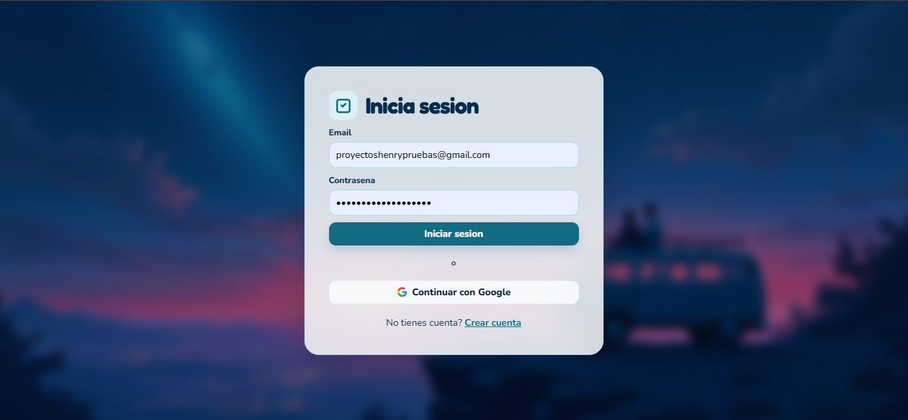
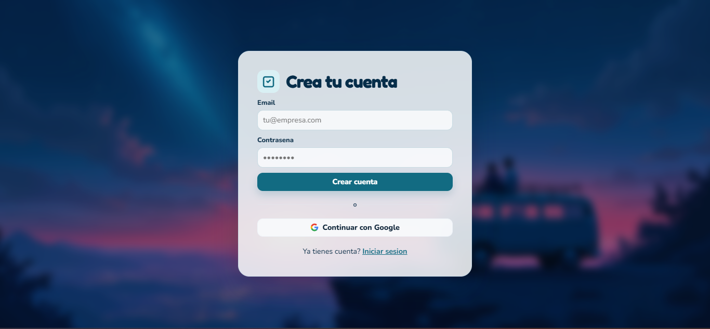
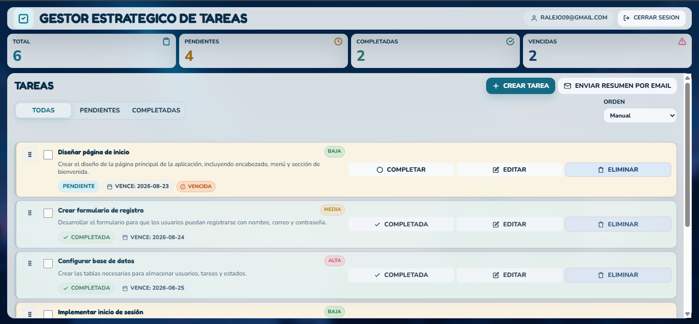
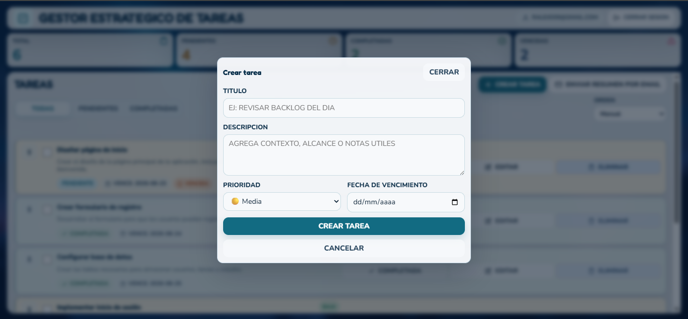
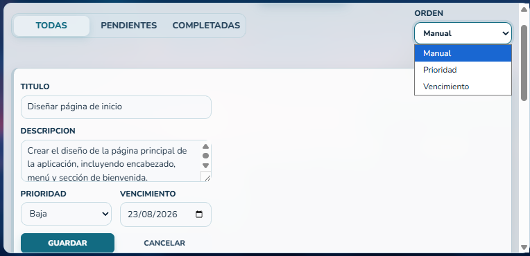
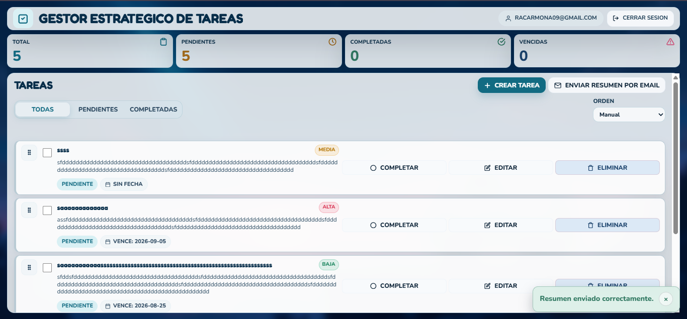
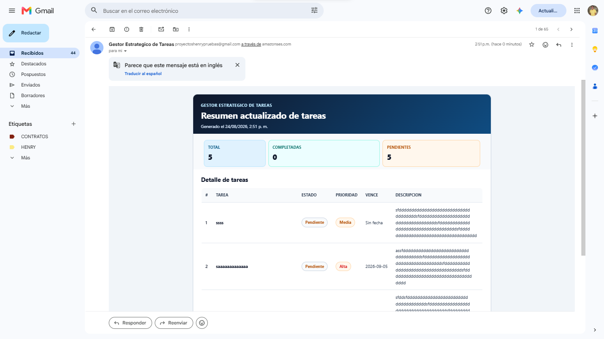
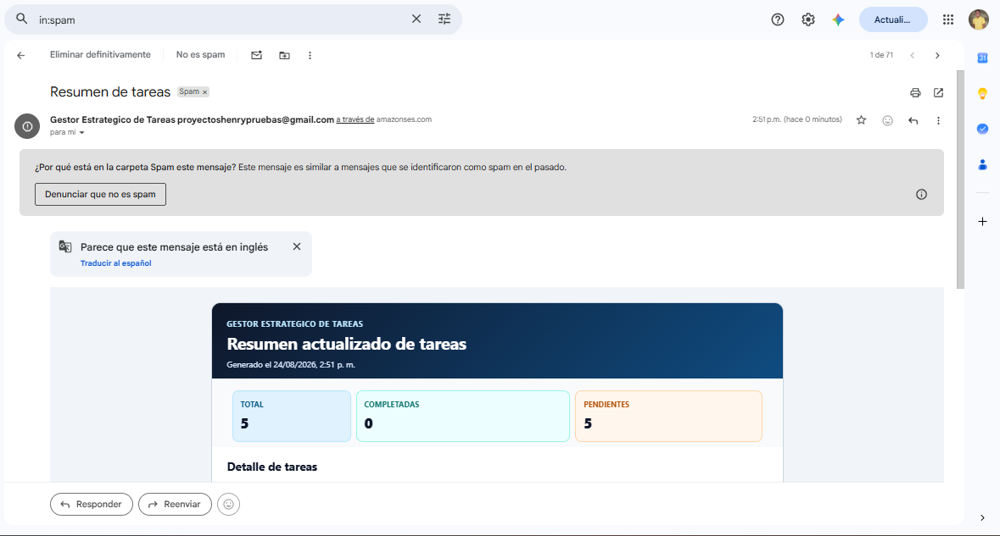

# Gestor Estrategico de Tareas - Proyecto Integrador M4

Proyecto Integrador del Modulo 4  
Autor: Raul Alejandro Carmona Cuellar

> SPA responsive para gestion de tareas con autenticacion, CRUD en tiempo real con Firebase, y envio de resumen por email usando Vercel Functions + AWS SES.

URL en produccion: pendiente de agregar tras deploy final en Vercel.

Repositorio: pendiente de agregar URL del repo en GitHub.

API usada (auth + database): https://firebase.google.com/

Servicio de email transaccional: https://aws.amazon.com/ses/

---

## Que hace el proyecto

Gestor Estrategico de Tareas permite que cada usuario inicie sesion, administre sus tareas y envie por email un resumen visual de su tablero.

Incluye:

- Registro, login, logout y rutas protegidas.
- CRUD completo de tareas por usuario.
- Filtros por estado: todas, pendientes y completadas.
- Priorizacion de tareas: baja, media y alta.
- Fecha de vencimiento y deteccion de vencidas.
- Orden manual con drag and drop y orden alternativo por criterios.
- Envio de resumen por email desde backend serverless.
- Feedback visual por toast para respuestas de acciones y errores.

---

## Funcionamiento

### Flujo general

1. El usuario se registra o inicia sesion.
2. La aplicacion protege las rutas privadas y carga solo los datos del usuario autenticado.
3. Las tareas se crean/actualizan/eliminan en Cloud Firestore bajo la estructura `users/{userId}/tasks/{taskId}`.
4. El frontend sincroniza estado y UI con el hook de tareas (`useTasks`).
5. Al presionar Enviar resumen por email, el frontend manda `recipientEmail + tasks` a `/api/send-task-summary`.
6. La Vercel Function valida payload y variables, arma resumen en texto + HTML y usa AWS SES para enviar.
7. El usuario recibe feedback en toast (exito o error).

### Flujo del resumen por email

1. Boton Enviar resumen por email en la vista de tareas.
2. Request `POST` a `/api/send-task-summary`.
3. Validacion de metodo, email destino, cantidad y estructura de tareas.
4. Render del correo en formato HTML mejorado + respaldo en texto plano.
5. Entrega por AWS SES con remitente visible: Gestor Estrategico de Tareas.

Nota importante sobre entregabilidad:

- En Gmail, el resumen puede llegar inicialmente a Spam/Correo no deseado.
- Esto es normal en ambientes de prueba con SES (especialmente en sandbox o sin dominio corporativo verificado).

---

## Correo de prueba para rubrica

Se dejo un correo de Gmail de pruebas para evaluaciones funcionales:

- Usuario: proyectoshenrypruebas@gmail.com
- Contrasena: ProyectosHenry2026*

Uso recomendado:

- Solo para pruebas del proyecto y verificacion de flujo de autenticacion/email.
- Revisar bandeja Spam/No deseado despues de enviar resumen.

---

## Stack tecnico

- React 19 + TypeScript + Vite.
- React Router.
- Firebase Authentication + Cloud Firestore.
- Vercel Functions.
- AWS SES con AWS SDK v3.
- Vitest + React Testing Library.
- dnd-kit para drag and drop.

---

## Arquitectura

```text
React UI -> Hooks -> Services -> Firebase Auth / Firestore
React UI -> emailService -> /api/send-task-summary -> AWS SES
```

Estructura principal:

```text
src/
  components/       UI reusable, feedback y layout
  config/           configuracion Firebase desde env
  features/auth/    auth provider y formulario
  features/tasks/   formulario, lista, item, filtros y DnD
  hooks/            integracion React + Firestore
  pages/            login, register, tasks y 404
  routes/           guards public/private
  services/         auth, firestore y email API
  types/            contratos compartidos
  utils/            validaciones, filtros y ordenamiento
api/                Vercel Function send-task-summary
tests/              pruebas unitarias y de componentes
```

---

## Instalacion y ejecucion local

### Requisitos

- Node.js 18 o superior.
- npm.
- Cuenta de Firebase.
- Cuenta AWS SES.
- Vercel CLI (opcional, recomendado para flujo serverless local).

### Instalar dependencias

```bash
npm install
```

### Variables de entorno

Crear `.env` local basandose en `.env.example`:

```env
VITE_FIREBASE_API_KEY=
VITE_FIREBASE_AUTH_DOMAIN=
VITE_FIREBASE_PROJECT_ID=
VITE_FIREBASE_STORAGE_BUCKET=
VITE_FIREBASE_MESSAGING_SENDER_ID=
VITE_FIREBASE_APP_ID=

AWS_REGION=
AWS_ACCESS_KEY_ID=
AWS_SECRET_ACCESS_KEY=
AWS_SES_FROM_EMAIL=
```

### Ejecutar en desarrollo

Con Vite (solo frontend):

```bash
npm run dev
```

Con Vercel Dev (frontend + function `/api`):

```bash
npx vercel dev
```

Si el puerto 3000 esta ocupado:

```bash
npx vercel dev --listen 3200
```

---

## Scripts utiles

```bash
npm run typecheck
npm run test
npm run build
npm run preview
npm run audit
```

---

## Testing

Este proyecto usa Vitest + React Testing Library y cubre logica de dominio, componentes, hooks y endpoint serverless.

### Como correr los tests

```bash
npm run test
```

### Suites principales

- `tests/utils/taskUtils.test.ts`: validacion de filtros, ordenamiento y transformaciones de tareas.
- `tests/utils/authErrors.test.ts`: mapeo de errores tecnicos de auth a mensajes seguros para UI.
- `tests/components/TaskForm.test.tsx`: flujo de creacion, validaciones y callbacks del formulario.
- `tests/components/TaskList.test.tsx`: render de lista, acciones de completar/eliminar y estados vacios.
- `tests/hooks/useTasks.test.tsx`: carga inicial, sincronizacion, errores y rollback optimista.
- `tests/auth/AuthProvider.test.tsx`: login/register/logout y estado de sesion.
- `tests/routes/RouteGuards.test.tsx`: proteccion de rutas privadas/publicas.
- `tests/services/emailService.test.ts`: contrato del cliente HTTP para envio de resumen.
- `tests/api/sendTaskSummaryApi.test.ts`: endpoint serverless con escenarios 405/400/500/502/200.

### Validaciones recomendadas antes de entregar

```bash
npm run typecheck
npm run test
npm run build
```

Objetivo de esta secuencia:

- Asegurar tipado estricto sin errores.
- Verificar comportamiento funcional de frontend y backend mockeado.
- Confirmar que el build de produccion compila correctamente.

---

## Evidencia visual (GIF + capturas)

### GIF principal de funcionamiento

Flujo esperado del GIF:

1. Login.
2. Crear tarea.
3. Cambiar estado/completar.
4. Enviar resumen por email.
5. Visualizar toast de exito.
6. Abrir correo recibido.

Pendiente de reemplazar cuando se exporte el GIF final:


### Capturas del proyecto

#### 1) Pantalla de inicio de sesion


#### 2) Pantalla de registro


#### 3) Tablero principal con estadisticas y tareas


#### 4) Modal de creacion de tarea


#### 5) Filtros, orden y edicion


#### 6) Toast de feedback al enviar resumen


#### 7) Correo recibido con plantilla HTML


#### 8) Ejemplo de correo llegando a Spam


---

## Seguridad y consideraciones

- `.env` y `.env.*` estan ignorados por git; `.env.example` si se versiona.
- Variables AWS se usan solo server-side en `api/send-task-summary.ts`.
- Firestore Rules evita acceso entre usuarios.
- La function valida payload y metodo HTTP.
- El correo de pruebas de este README es solo para contexto academico de demostracion.

---

## Uso de IA

El proyecto fue realizado por Raul Alejandro Carmona Cuellar.

La IA se uso como apoyo tecnico para:

- Revisar arquitectura y buenas practicas.
- Proponer mejoras de UI/UX.
- Auditar validaciones, seguridad y pruebas.
- Refinar documentacion.

Las decisiones finales de implementacion y entrega fueron del estudiante.

### Prompts enviados y respuestas dadas por IA (agente/chat)

1) Prompt enviado:

```text
Tengo una SPA React con Firebase. Como separo capas para que auth, tareas y servicios queden mantenibles?
```

Respuesta dada por IA:

```text
Separa por features y responsabilidades: features/auth, features/tasks, hooks para orquestacion de estado, services para acceso a Firebase/API, y types/utils compartidos. Usa rutas protegidas y provider de auth en el nivel superior.
```

2) Prompt enviado:

```text
Quiero guardar tareas por usuario en Firestore y evitar que un usuario vea las de otro. Que modelo y reglas recomiendas?
```

Respuesta dada por IA:

```text
Usa users/{userId}/tasks/{taskId}. En reglas, permite lectura/escritura solo cuando request.auth.uid == userId. Este modelo simplifica queries por usuario y reduce riesgo de acceso cruzado.
```

3) Prompt enviado:

```text
Ayudame a implementar un endpoint en Vercel para enviar resumen de tareas con AWS SES, validando payload y errores.
```

Respuesta dada por IA:

```text
Crea /api/send-task-summary, valida metodo POST, email y lista de tareas, arma cuerpo texto+HTML, envia con SESClient y devuelve errores controlados (400/405/500/502) sin exponer datos sensibles.
```

4) Prompt enviado:

```text
Quiero mejorar UX: el mensaje de exito/error de enviar resumen no quiero verlo inline, sino como toast.
```

Respuesta dada por IA:

```text
Implementa un componente ToastMessage reutilizable con variantes success/error/info, autocierre por timeout, cierre manual y aria-live para accesibilidad.
```

5) Prompt enviado:

```text
Que pruebas minimas debo tener para demostrar calidad en este proyecto?
```

Respuesta dada por IA:

```text
Incluye pruebas de utilidades, componentes clave, hook principal, guards de rutas, servicio HTTP y endpoint API. Agrega typecheck y build en checklist final para validar calidad tecnica.
```

6) Prompt enviado:

```text
Necesito que el README quede listo para rubrica: estructura, flujo, pruebas, deploy y evidencia visual.
```

Respuesta dada por IA:

```text
Ordena enlaces arriba, explica flujo funcional end-to-end, documenta setup/env/scripts/tests, agrega notas de SES y spam, y reserva seccion de GIF/capturas con nombres de archivo consistentes.
```
